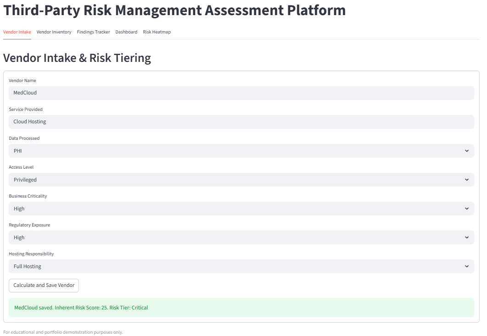
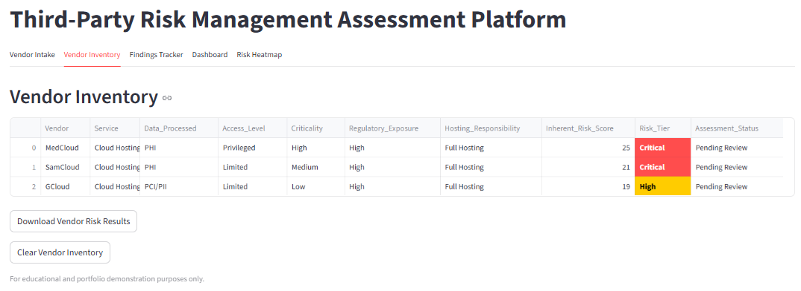
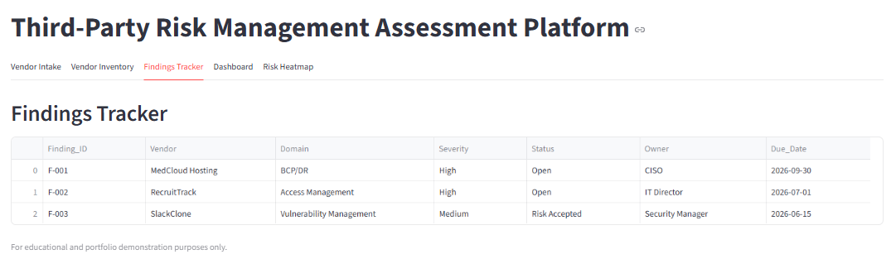
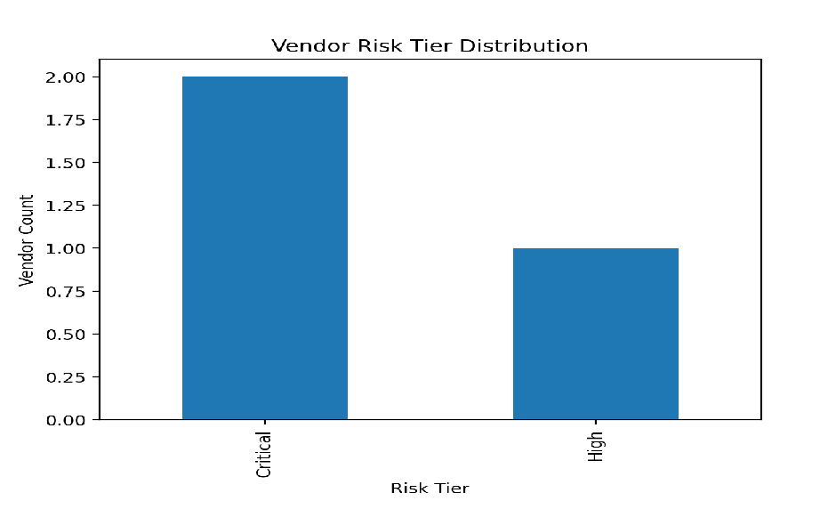
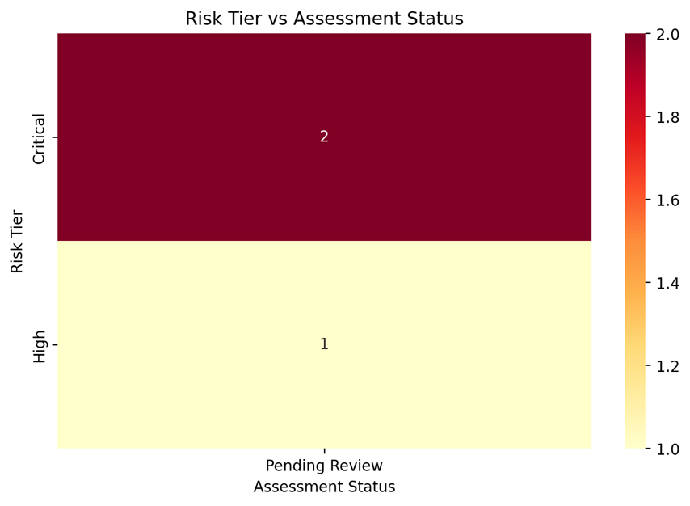

# Third-Party Risk Assessment Program


## Overview
This project demonstrates the design and execution of a mock **Third-Party Risk Management (TPRM) Program** for evaluating SaaS vendors using structured risk-tiering, due diligence questionnaires, control assessments, and automated risk scoring.

The program simulates a real-world vendor risk lifecycle from onboarding through residual risk determination and executive reporting.

---

## Objectives
- Build a scalable vendor risk assessment workflow
- Perform inherent and residual risk evaluations
- Assess vendor security/compliance posture
- Automate risk scoring and reporting using Python
- Produce executive-ready dashboards and findings reports

---

## Framework Alignment
This project aligns to industry-recognized TPRM and security guidance:

- NIST SP 800-161 – Cyber Supply Chain Risk Management
- ISO/IEC 27036 – Supplier Relationships Security
- Shared Assessments SIG Concepts
- HIPAA / PCI / SOC 2 Considerations

---

## Local Setup

```bash
python -m venv .venv
.venv\Scripts\activate
pip install -r requirements.txt
python -m streamlit run app.py
```

---

## TPRM Workflow

```text
Vendor Request Submitted
        ↓
Initial Vendor Intake
        ↓
Inherent Risk Assessment
        ↓
Risk Tier Assignment
        ↓
Due Diligence Questionnaire Issued
        ↓
Evidence / Documentation Review
        ↓
Security & Compliance Assessment
        ↓
Findings / Gap Identification
        ↓
Residual Risk Determination
        ↓
Risk Acceptance / Remediation Plan
        ↓
Vendor Approval / Rejection
        ↓
Continuous Monitoring / Reassessment
```

---

## Operating Model

This project includes an enterprise-style RACI matrix defining stakeholder ownership across the TPRM lifecycle, demonstrating understanding of cross-functional governance required for vendor risk management.

---

## Project Structure

```
third-party-risk-assessment-program/
│
├── README.md
├── methodology/
│   ├── tprm-methodology.md
│   ├── risk-tiering-model.xlsx
│
├── assessments/
│   ├── vendor-inventory.csv
│   ├── vendor-security-questionnaire.csv
│   ├── sample-findings.csv
│
├── automation/
│   ├── vendor_risk_scoring.py
│   ├── vendor-risk-results.csv
│
├── dashboards/
│   ├── vendor-risk-dashboard.xlsx
│
└── screenshots/
```

---

## Key Features

### Vendor Inventory Management
Tracks vendor criticality, data classifications, hosting model, and access level.

### Inherent Risk Tiering
Scores vendors based on:
- Data Sensitivity
- Access Level
- Business Criticality
- Regulatory Exposure
- Hosting Responsibility

### Security Questionnaire
Evaluates vendor security controls across:
- Access Management
- Encryption
- Incident Response
- Disaster Recovery
- Vulnerability Management
- Compliance Certifications
- Subprocessor Oversight

### Findings Management
Tracks identified control gaps, severity, and remediation recommendations.

### Python Automation
Automates:
- Risk score calculations
- Tier assignment
- Results export to CSV
- Dashboard data preparation

---

## Sample Risk Tiering Logic

| Score | Tier |
|-------|------|
| 5–9 | Low |
| 10–14 | Medium |
| 15–19 | High |
| 20–25 | Critical |

---

## Application Preview

### Vendor Intake


### Vendor Inventory


### Findings Tracker


### Executive Dashboard


### Dedicated Risk Heatmap Analysis


---

## Tools Used
- Python
- Pandas
- Excel / CSV
- GitHub
- Markdown

---

## Future Enhancements

- Automated PDF Assessment Reports
- API Integration with GRC Platforms
- Risk Trend Analytics
- Continuous Monitoring Logic

---

## Sample Outcomes
- Assessed 5 mock SaaS vendors
- Identified 12 control gaps across reviewed domains
- Classified 2 vendors as High Risk and 1 as Critical
- Reduced manual scoring effort through Python automation

---

## Author
George Jordan

---

## Disclaimer
This project is for educational and portfolio purposes only. Vendor data is fictional and does not represent real organizations.
